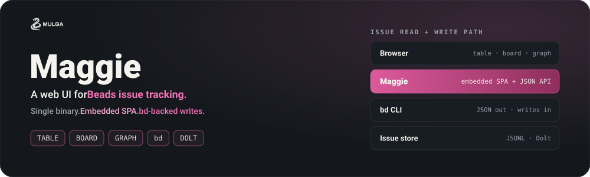

<p align="center">
  
</p>

<p align="center">
  <a href="https://go.dev"></a>
  <a href="LICENSE"></a>
  <a href="https://mulgadc.com"></a>
</p>

<p align="center">
  <a href="#why-maggie">Why Maggie?</a> ·
  <a href="#quick-start">Quick start</a> ·
  <a href="#build-from-source">Build from source</a> ·
  <a href="#views">Views</a> ·
  <a href="#architecture">Architecture</a> ·
  <a href="#configuration">Configuration</a> ·
  <a href="#deployment">Deployment</a> ·
  <a href="#development">Development</a> ·
  <a href="#security">Security</a>
</p>

---

# Maggie: a fast web UI for Beads issue tracking.

Maggie is a single Go binary that serves a web UI over [Beads](https://github.com/steveyegge/beads), the `bd` issue tracker.

## Why Maggie?

`bd` is complete but text-only, and some questions are far easier to answer visually — what is blocked on what, which epic is stalling, where the work has piled up.

- **No second source of truth.** Every read and write goes through `bd`, so validation, IDs, history and hooks behave exactly as they do on the command line. The server keeps no store of its own, which means nothing to back up, migrate or keep in sync.
- **One binary to deploy.** The compiled frontend is embedded with `go:embed`. Copy it to a host, point it at a repo, done.
- **Works on the repo you already have.** Point `MAGGIE_BEADS_DIR` at any checkout with a `.beads/` directory.

## Quick Start

The container bundles `maggie` and the `bd` CLI, so there is nothing to install and no database to stand up. Point it at any checkout that already has a `.beads/` directory:

```bash
cd /path/to/your/repo

docker run --rm -p 8088:8088 \
  --user "$(id -u):$(id -g)" \
  -v "$PWD/.beads:/repo/.beads" \
  ghcr.io/mulgadc/maggie:latest
```

Then open <http://localhost:8088>.

Only `.beads/` is mounted — maggie never needs the rest of your checkout. `bd` runs inside the container against its embedded Dolt engine, so the mounted directory *is* the database.

Two things worth getting right up front:

- **`--user` keeps file ownership yours.** Without it, Docker runs as root and anything maggie writes lands in your repo owned by root. Maggie warns at startup if you skip it. Rootless Podman already maps the container user back to you, so it is optional there.
- **The `bd` version must match.** The image bundles `bd` v1.0.5, and a beads database embeds the schema its `bd` expects. Serving a `.beads/` written by a different version is the documented way to corrupt it. Maggie logs the bundled version at startup — check it against `bd version` on the host.

Podman works with the same command:

```bash
podman run --rm -p 8088:8088 -v "$PWD/.beads:/repo/.beads:Z" ghcr.io/mulgadc/maggie:latest
```

## Build From Source

**Prerequisites**

| Tool | Version | Notes |
|------|---------|-------|
| Go | 1.27+ | to build the binary |
| Node.js | 24.14.0 | pinned in `frontend/.nvmrc` |
| pnpm | 12.3.4 | pinned via `packageManager` in `frontend/package.json` |
| `bd` | 1.0.5 | the [Beads](https://github.com/steveyegge/beads) CLI, on `PATH` |

```bash
git clone https://github.com/mulgadc/maggie.git
cd maggie
make build
MAGGIE_BEADS_DIR=/path/to/your/repo ./maggie
```

`make build` runs the frontend build first — the compiled SPA is embedded with `go:embed`, so the result is one self-contained binary with no runtime assets to ship.

To build the container image instead:

```bash
make docker-build
```

## Views

| Route | What it shows |
|-------|---------------|
| `/` | Dashboard: a suggested work sequence, open issues by priority and by area, critical and high, ready to start, and recently updated |
| `/table` | Sortable, filterable issue table, groupable by epic or by label |
| `/board` | Kanban board by status; drag a card to change status |
| `/graph` | Force-directed dependency graph, solid edges for blockers and dashed for parent/child |

The dashboard can be focused on one assignee or one issue-id prefix, so it shows a single person's or a single area's work.

Filters, sorting and grouping are held in the URL query string, so any view you are looking at is a link you can paste to someone else.

Clicking an issue opens a detail panel for editing description, notes, acceptance criteria, priority, status, assignee, labels, comments and dependencies.

## Architecture

```
Browser ── HTTP ──▶ maggie ── exec ──▶ bd ──▶ .beads/ (JSONL or Dolt)
   SPA              Go binary          CLI
```

- **`cmd/maggie`** — HTTP server. Serves the embedded SPA, falling back to `index.html` for client-side routes, and exposes the JSON API the SPA calls. Text responses are gzipped, hashed assets are cached immutably, and security headers are set on every response. `GET /health` is a liveness probe returning `{"status":"ok","version":...}`; it never shells out to `bd`.
- **`internal/beads`** — the `bd` wrapper. Builds the argv, applies a per-command timeout, and forwards `bd`'s JSON to the client untouched.

Reads forward `bd`'s own JSON verbatim rather than remodelling it, so Maggie does not drift from the CLI as beads evolves.

## Configuration

All configuration is environment variables. There is no config file.

| Var | Default | Description |
|-----|---------|-------------|
| `MAGGIE_ADDR` | `:8088` | Listen address |
| `MAGGIE_BEADS_DIR` | `.` | Working directory containing `.beads/` |
| `MAGGIE_BD_BIN` | `bd` | Path to the `bd` binary |
| `MAGGIE_ACTORS` | — | Comma-separated identity roster for the edit picker |
| `MAGGIE_LOG_LEVEL` | `info` | `debug`, `info`, `warn` or `error` |

Logs are JSON on stdout. An unusable `MAGGIE_LOG_LEVEL` is a startup error rather than a silent fall back, so a typo cannot leave a deployment quietly logging at the wrong verbosity.

Edits are attributed with `bd --actor`. Maggie has no login, so the identity is self-asserted: pick one from the `MAGGIE_ACTORS` roster or type your own. Leaving the roster unset just means everyone types a name.

## Deployment

The image bundles `maggie`, `bd` and `dolt`. The entrypoint's first argument picks a role, so one image covers both deployment modes.

### Mode 1 — one person, one checkout (default)

What the Quick Start above does. `bd` runs inside the container against the embedded Dolt engine in your mounted `.beads/` directory. No server, no seeding, nothing to back up beyond the directory itself.

Use it for your own repo, a demo, or a read-only view of someone's tracker.

Both your host `bd` and the container can use the same `.beads/` — each `bd` invocation is short-lived and takes the lock only while it runs, so concurrent reads are fine. Avoid writing from both at the same moment.

### Mode 2 — a shared tracker for a team

One Dolt SQL server holds the database and everyone's `bd` connects to it as a client, with maggie as the web view onto the same server. This is what the compose stack builds:

```bash
mkdir -p snapshot
cp /path/to/your/repo/.beads/issues.jsonl snapshot/issues.jsonl

make docker-build
make docker-seed        # imports the snapshot into the dolt volume
make docker-up          # http://localhost:8088

make docker-refresh     # later: stop dolt -> re-seed -> start dolt
```

Setting this up for a team — client onboarding, accounts and grants, exposing the port safely, backups — is in **[docs/deployment.md](docs/deployment.md)**.

Versions are pinned as build args in the `Dockerfile`: `GO_VERSION` (1.27), `BD_VERSION` (v1.0.5) and `DOLT_VERSION` (2.1.10). `make docker-backup` exports the live database back out to JSONL.

## Development

```bash
make run    # backend on :8088          (terminal 1)
make dev    # Vite on :3001, proxying /api -> :8088, with hot reload (terminal 2)
```

## Security

**Maggie has no authentication.** Anyone who can reach the port can read and modify every issue in the store.

Run it on a trusted network, or behind an authenticating reverse proxy that terminates TLS. If you use the compose stack, keep the Dolt port (`3307`) internal and never publish it.

To report a vulnerability, see [SECURITY.md](SECURITY.md).

## Trademarks

Beads is a project by Steve Yegge. Dolt is a trademark of DoltHub, Inc. Maggie is not affiliated with or endorsed by either.

## License

Maggie is licensed under the [GNU Affero General Public License v3.0 (AGPLv3)](LICENSE) license.
